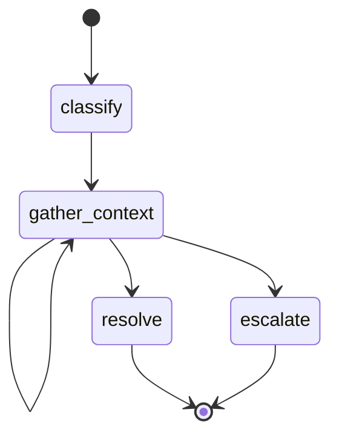
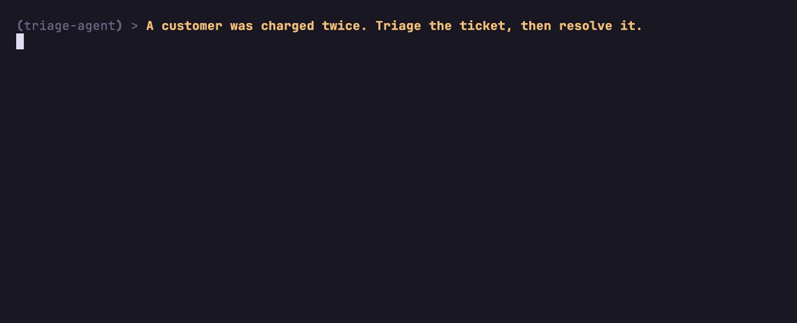
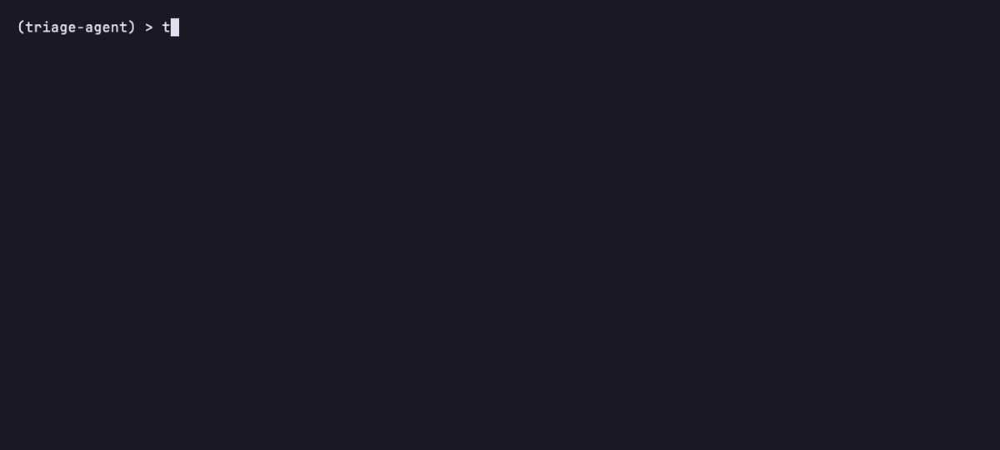

# triage-agent

A support-ticket triage agent built with
[BurrMCP](https://github.com/msradam/burrmcp): a triage workflow defined as a
[Burr](https://burr.dagworks.io/) state machine and served as an
[MCP](https://modelcontextprotocol.io/) server. An LLM classifies the ticket,
gathers context, and decides, one enforced transition at a time.



This diagram is the contract. The agent can only move along these edges; the
server refuses any step that is not a reachable transition. The gate is
structural: there is no edge from `classify` straight to `resolve` or
`escalate`, so an agent that tries to close a ticket before gathering any
context gets a refusal. This is the step up from a toy: a real "investigate
before you decide" policy, enforced by the graph rather than asked of the model.

An LLM drives it over MCP. Here fast-agent connects a Llama-3.3-70B model
(on Together); when the model calls an action with the wrong inputs, the server
returns a structured error and the model corrects itself:



The same workflow is observable from the terminal. `triage-agent render` prints
the graph; `triage-agent sessions show` replays a recorded run:



## Install

```bash
git clone https://github.com/msradam/triage-agent.git
cd triage-agent
uv venv --python 3.13
uv pip install -e .
```

## Run it as an agent

The repo ships an `.mcp.json` pointing a client at `triage-agent serve`.

### Claude Code

```bash
claude mcp add --transport stdio triage-agent -- uv run triage-agent serve
claude
```

Then: "A customer was double-charged. Triage it." Claude classifies, records
findings with `gather_context`, then resolves or escalates.

### fast-agent (terminal REPL)

The repo ships a `fastagent.config.yaml` defining this server, so:

```bash
uvx fast-agent-mcp go --servers triage-agent -m "A customer was double-charged. Triage it."
```

It uses Gemini by default (set `GOOGLE_API_KEY`). To drive it with a Together
model instead, set `GENERIC_API_KEY` and add
`--model generic.meta-llama/Llama-3.3-70B-Instruct-Turbo`.

### MCPJam (one npx command, browser playground, free models)

```bash
npx @mcpjam/inspector
```

Add the server with command `uv`, args `run triage-agent serve`.

## Watch what it did

```bash
uv run triage-agent sessions show     # per-step timeline; refused decisions in red
uv run triage-agent watch             # live-tail
```

## License

Apache 2.0. Built on [BurrMCP](https://github.com/msradam/burrmcp),
[Apache Burr](https://github.com/apache/burr), and
[FastMCP](https://github.com/jlowin/fastmcp).
